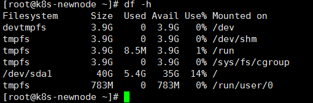
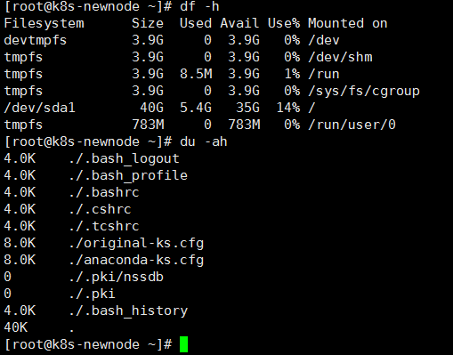
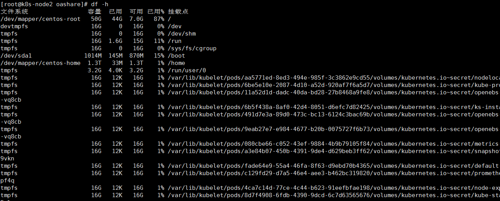

## Linux磁盘分区的详细步骤
查看系统信息 
    
    uname -a
    cat /proc/version
    cat /etc/issue
    lsb_release -a

### 看磁盘/目录树

### 一、df命令查看磁盘的分区和已经使用量
  
解释下输出的第一行中某些字段的含义：

| 文件系统 |	容量|	已用|	可用|	挂载点|
| ----|----|----|----|----|
|代表磁盘的分区和内存中的某一个区域。|	磁盘总共的容量	|磁盘已经使用的容量|	磁盘未使用的容量	|该文件系统挂载在哪一个目录下|

### 二、利用du命令查询当前目录下的所有目录/文件所占的容量

###  三、dumpe2fs查看分区的具体使用情况

###  四、安装中文字符集


查看当前字符集

    echo $LANG

查看系统是否安装中文字符集支持

    locale -a | grep CN

若没有执行以下命令进行安装
    #CentOS6.x：
    yum groupinstall chinese-support
    

    #CentOS7.x
    yum install -y kde-l10n-Chinese
    yum reinstall -y glibc-common
    
    #定义字符集
    localedef -i zh_CN -f UTF-8 zh_CN.UTF-8
    
    #确认载入成功
    locale -a

###  五、加载字体文件

    /usr/share/fonts
       mkfontscale
     mkfontdir     //生成字体的索引信息
     fc-cache       //更新字体缓存

如果运行mkfontscale命令时终端提示mkfontscale: command not found，则需要首先安装这个命令
在Cent OS下运行如下命令：

### 使mkfontscale和mkfontdir命令正常运行
yum install mkfontscale 
### 使fc-cache命令正常运行。如果提示 fc-cache: command not found
yum install fontconfig


### 扩容技巧
1. 查看根分区大小
      
    可以看到，这里home目录空闲的空间还很大，因此，我们将home的空间分给根目录一些。

2. 将/home文件夹备份，删除/home文件系统所在的逻辑卷，增大/文件系统所在的逻辑卷，增大/文件系统大小，最后新建/home目录，并恢复/home文件夹下的内容。

3. 备份/home分区内容
   
        sudo tar cvf /run/home.tar /home

4. 卸载/home  
   要先终止所有使用/home文件系统的进程，这里要注意不要在/home目录下执行下面的操作：

        yum install psmisc
       
        sudo fuser -km /home
    然后，卸载：
        
   
        sudo umount /home
   
5. 删除/home所在的逻辑卷lv：
        
   
       sudo lvremove /dev/mapper/centos-home
   
6. 扩大根目录所在的逻辑卷，这里增大1T：

        sudo lvextend -L +1T /dev/mapper/centos-root

7.  扩大/文件系统：

        sudo xfs_growfs /dev/mapper/centos-root

8. 重建/home文件系统所需要的逻辑卷：

    由于刚才我们分出去1.0T，因此这里创建的逻辑卷大小为0.25T.

        sudo lvcreate -L 0.25T -n /dev/mapper/centos-home

9. 创建文件系统：

        sudo mkfs.xfs  /dev/mapper/centos-home
    
10. 将新建的文件系统挂载到/home目录下：
    
        sudo mount /dev/mapper/centos-home

11. 恢复/home目录的内容：
    
        sudo tar xvf /run/home.tar -C /

12. 删除/run下面的备份：

        sudo rm -rf /run/home.tar
    
    13.按文件大小排序
    
    ```
    du -sc * | sort -rn  | more
    ```
    


#### 方法2

##### lsblk  

1.查看硬盘挂载情况

```hell
lsblk  
```

##### fdisk -l

查看挂载之前的分区情况

```hell
fdisk -l
```

##### fdisk /dev/sdb

为新硬盘创建分区

```hell
Command （m for help）：输入：n
p
1
接着便会提示卷的起始地址和结束地址，都保持默认按回车的即可（意思是只分一个区）
输入“w”保存并推出
```

##### parted -l

查看原来分区的文件系统格式

```hell
parted -l
```

##### mkfs

对分区进行格式化

```hell
mkfs.xfs  /dev/sdb1
```

##### mount

给分区挂载到一个目录

```hell
mkdir /data
mount /dev/sdb1 /data   #挂载到/data目录下
lsblk                   #使用lsblk查看

echo "sleep 3s &&  mount /dev/sdb1 /var/lib/docker" >> /etc/rc.d/rc.local &chmod +x /etc/rc.d/rc.local
```

##### blkid

获取UUID 

```hell
blkid /dev/sdb1  #获取UUID
vi /etc/fstab    #编辑此文件，将挂载点写入开机启动
```

```hell
UUID=be7c41c7-d034-4cab-9940-b152de375162     /data      xfs    defaults      0  0
```

1.设备名,2.挂载点,3.系统类型,4.属性 ,5.数字 0 0(0.宕机记录 0不记 1记录 , 0. 开机检测等级 )


##### umount

卸载目录

```hell
umount  /data       #卸载/data目录
```


## Linux服务器之间互相拷贝文件

Linux之间拷贝文件 scp
版权
在两台Linux服务器之间拷贝文件或文件夹，使用命令：scp

语法：

scp    -r           dir              username@host:dir
命令   递归       要拷贝的文件路径   目的主机用户名@目的主机ip:目的路径
例子1：将本地文件夹推送到远程服务器上

将本地 /home/ 路径下的所有文件拷贝到远程主机ip为 192.168.178.130 的 /home/ 目录下

scp -r /home/ root@192.168.178.130:/home/
执行后要输入 yes 确定远程链接，并输入远程主机192.168.178.130 的 username 用户对应的密码，本例使用的是root用户，则输入root用户密码

例子2：将远程服务器上的文件拉取到本地

将远程服务器ip为192.168.178.128 上的 /root/hello.sh 文件拉取到本地的 /root/ 目录下

scp -r root@192.168.178.128:/root/hello.sh /root
执行后同样要输入 yes 确定远程链接，并输入远程主机192.168.178.128 的 username 用户对应的密码，本例使用的是root用户，则输入root用户密码


## nfs服务

> ` 客户端配置`

```shell
yum -y install nfs-utils
```

> 测试是否可用

```shell
showmount -e 192.168.56.160
```


> 脚本自动挂载
>
> `在需要挂载的目录先建立文件名`

```shell
mkdir -p /mnt/kubernetes
vi /usr/local/sbin/nfsboot.sh
```

```
#!/bin/bash

## This is NFS disk automount shell script

echo "NFS启动时间点:$(date +"%F %T")" >>nfs.log;

val=`df -h|grep website | wc -l`

if [ $val -eq 1 ]

then

          echo  "NFS目录/tmp/website已经挂载，无需再挂" >> nfs.log;

else 

mount  -o vers=3   192.168.56.160:/ifs/kubernetes/ /mnt/kubernetes/

echo  "NFS目录/tmp/website挂载成功" >> nfs.log;

exit

fi

echo "执行完毕" >> nfs.log
```

> 1.`给脚本赋予执行权限`

```
chmod +x /usr/local/sbin/nfsboot.sh
```

> 2.`将脚本加入开机自启动中`

```
vi /etc/rc.d/rc.local
```

- ​    输入i  在最后面插入

```
/usr/local/sbin/nfsboot.sh    
```

- ​    保存退出

> 赋权

```
chmod +x     /etc/rc.d/rc.local
```

- 然后服务器重启验证是否自动挂载


## 工具安装

### zsh 命令安装

[蔡广Gitee](https://gitee.com/caiguang_cc/ohmyzsh)

- 前置条件安装git 点击 [下载](https://github.com/git/git/releases) [安装git](https://blog.csdn.net/qq_575775600/article/details/120997367) 工具

```shell
#安装zsh
yum install zsh -y
```


```shell
#下载自动安装 输入 y 即可
sh -c "$(curl -fsSL https://gitee.com/caiguang_cc/ohmyzsh/raw/master/tools/install.sh)"
```

- 修改插件

```shell
 #目录 cd ~
 vi .zshrc
```

​       修改括号的内容既可选择使用的插件

```shell
plugins=(
        zsh-autosuggestions
        zsh-syntax-highlighting
        incr
)
```

- 修改后生效 命令

```shell
#目录 cd ~
source .zshrc 
```


## Centos7 IP配置

> `cd /etc/sysconfig/network-scripts`

```shell
TYPE="Ethernet"
  PROXY_METHOD="none"
  BROWSER_ONLY="no"
  BOOTPROTO="static"
  DEFROUTE="yes"
  IPV4_FAILURE_FATAL="no"
  IPV6INIT="yes"
  IPV6_AUTOCONF="yes"
  IPV6_DEFROUTE="yes"
  IPV6_FAILURE_FATAL="no"
  IPV6_ADDR_GEN_MODE="stable-privacy"
  NAME="ens0"
  UUID="b4af2f5f-f889-40d6-9058-2eff9f29539b"
  DEVICE="eth0"
  ONBOOT="yes"
  IPADDR=192.168.1.100
  NETMASK=255.255.255.0
  GATEWAY=192.168.1.1
  DNS1=192.168.1.1
  DNS2=8.8.8.8
  #95b614cd-79b0-4755-b08d-99f1cca7271b
```

```shell
systemctl restart network
```


## 修改host-name

```shell
hostnamectl --static set-hostname
```

1.临时修改方法---------  执行命令 hostname=你要修改的主机名，重启后失效，仅当前有效。

2.修改 /etc/sysconfig/network 文件，同时修改/etc/hosts 文件，必须要同时修改，修改后永久有效。这个修改方法为centos5 6版本主流修改方法。

vim /etc/sysconfig/network

NETWORKING=yes

HOSTNAME=要修改的hostname

退出，保存。

vim /etc/hosts  最后新加一行，当前IP地址   要修改的hostname

退出，保存，然后重启即可。

3、执行命令 hostnamectl --static set-hostname 想要的主机名 。

4. 修改内核控制文件 /etc/sysctl.conf，这个文件是修改内核 的接口文件，权限最高，没有之一，修改该文件需要root权限。

vim /etc/sysctl.conf  

最后一行添加 kernel.hostname=你想要的hostname。

保存退出。执行命令：sysctl -p

该方法立刻永久生效。

总结：最高优先级是第四方法，修改内核配置，其次是命令和修改 /etc/hostname文件，再次是修改 /etc/sysconfig/network和 /etc/hosts ，这么说吧，如果定义了  /etc/sysctl.conf文件内的hostname,别的怎么修改都不好使，以此类推。

一般还是使用第三个方法，这个方法在centos7系列比较常用。


## 部署蒲公英穿透

> `docker`


```
docker run -d --device=/dev/net/tun --name pgyvpn --net=host --cap-add=NET_ADMIN --env PGY_USERNAME="67423023:002" --env PGY_PASSWORD="zxh123456" bestoray/pgyvpn
echo "sleep 60s &&docker start pgyvpn" >> /etc/rc.d/rc.local 
chmod +x /etc/rc.d/rc.local
```


**kubernetes 初始化集群**

```
kubeadm init \
  --apiserver-advertise-address=192.168.1.100 \
  --image-repository registry.aliyuncs.com/google_containers \
  --kubernetes-version v1.20.6 \
  --service-cidr=10.96.0.0/12 \
  --pod-network-cidr=10.244.0.0/16 \
  --ignore-preflight-errors=all
  
  
apiVersion: kubeadm.k8s.io/v1beta2
kind: ClusterConfiguration
kubernetesVersion: v1.21.0
imageRepository: registry.aliyuncs.com/google_containers 
networking:
  podSubnet: 10.244.0.0/16 
  serviceSubnet: 10.96.0.0/12
```


## [helm 部署minio](http://www.manongjc.com/detail/29-fzjlwjhanxbptxx.html)

```
helm repo add minio https://helm.min.io/
helm fetch minio/minio
tar zxvf minio-8.0.10.tgz
cd minio
vi values.yaml
#测试环境节约内存---改内存 
resources:
　　　　  requests:
　　　　    memory: 256Mi
```

进入到 `minio`目录下　

```shell
helm install minio \
--namespace minio \
--create-namespace \
--set accessKey=minio,secretKey=minio123 \
--set mode=standalone \
--set service.type=NodePort \
--set persistence.enabled=true \
--set persistence.size=1Gi \
--set persistence.storageClass=managed-nfs-storage \
-f values.yaml minio/minio
```


## 安装mysql8

### 1.下载MySQL安装脚本

```shell
wget  http://dl.qiyuesuo.com/private/mysql/mysqlinstall.sh
```

### 2.执行脚本（5.7使用1，8.0使用2）

```shell
/bin/bash mysqlinstall.sh 2
```

### 3.输入自定义MySQL安装路径，默认为/mysql， 如果指定的目录不存在则自动创建(最好由脚本自动创建或者保证指定的目录为一个空目录)

```shell
/mysql
```

### 4.指定root用户密码，至少8位，至少包含大小写字母、数字、特殊字符中的三者（否则之后重启数据库会提示密码错误无法登录） 如果出现此问题请参考知识树[修改密码]()

```shell
Root@123
```

### 5.安装成功 ，请根据服务器磁盘类型优化/etc/my.cnf文件末尾的innodb_io_capacity和innodb_io_capacity_max参数

```config
# innodb_io_capacity_max一般设置为innodb_io_capacity的2倍，对于SSD硬盘，innodb_io_capacity可以设置8000更高甚至上万的值，对于普通SAS硬盘，可设置200，对于sas raid10可设置2000，对于fusion-io闪存设备可设置几万以上，注意：此参数对于数据库性能影响很大，根据实际磁盘类型进行调整。
```

### 6.改完参数后重启数据库服务，至此安装结束

```shell
systemctl restart mysqld
```

### 7.改完参数后重启数据库服务，至此安装结束

```mysql
mysql -uroot -pRoot@123
create user 'root'@'10.30.94.45' identified by 'Root@123';
grant all privileges on *.* to 'root'@'10.30.94.45' with grant option;
flush privileges;
```

create user 'root'@'10.30.30.112' identified by 'Root@123';
