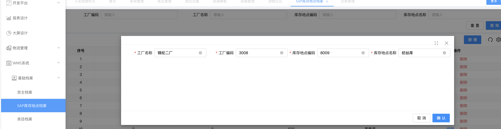
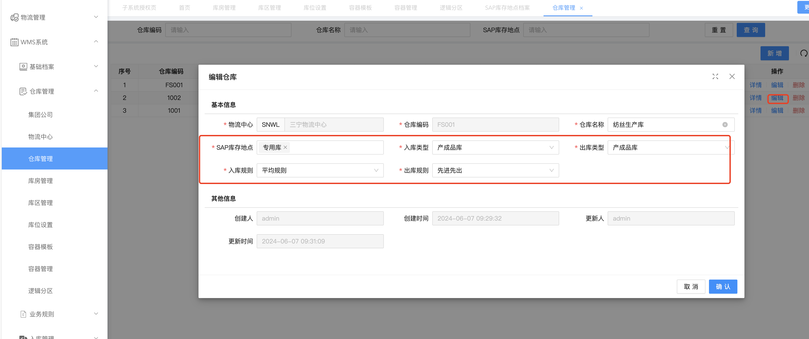

纺丝库配置手册


新增SAP库存地点



```sql
INSERT INTO base_main_inventory_location ( id, inventory_location_code, inventory_location_name, update_time,create_by,factory_code,factory_name ) VALUES ( 38, 8009, '纺丝库', '2024-06-17 10:15:55','admin',3008,'锦纶二厂' ) 
```


仓库管理




>  如果没有需要的内容需要先新增内容

```sql

#先新增入库规则
INSERT INTO wms_sn_base.base_main_dictionary_data (id, dict_parent_code, dict_code, dict_label, dict_label_en, dict_value, dict_sort, dict_description, default_flag, usage_flag, create_by, create_time, update_by, update_time, delete_mark) VALUES (1798885517119582210, 'IN_RULES', 'EFFICIENCY_RULES', '效率规则', 'EFFICIENCY_RULES', 'EFFICIENCY_RULES', 1, '效率规则', 0, 1, null, '2024-06-07 09:11:43', null, null, 0);
INSERT INTO wms_sn_base.base_main_dictionary_data (id, dict_parent_code, dict_code, dict_label, dict_label_en, dict_value, dict_sort, dict_description, default_flag, usage_flag, create_by, create_time, update_by, update_time, delete_mark) VALUES (1798885955571150850, 'IN_RULES', 'AVERAGE_RULES', '平均规则', 'AVERAGE_RULES', 'AVERAGE_RULES', 2, '平均规则', 0, 1, null, '2024-06-07 09:13:28', null, null, 0);
#新增出库规则
INSERT INTO wms_sn_base.base_main_dictionary_data (id, dict_parent_code, dict_code, dict_label, dict_label_en, dict_value, dict_sort, dict_description, default_flag, usage_flag, create_by, create_time, update_by, update_time, delete_mark) VALUES (1798887188956573698, 'OUT_RULES', 'FIFO', '先进先出', 'FIFO', 'FIFO', 1, '先进先出', 0, 1, null, '2024-06-07 09:18:22', null, null, 0);

INSERT INTO wms_sn_base.base_main_dictionary_type (id, dict_name, dict_name_en, dict_code, dict_type, dict_description, system_flag, usage_flag, create_by, create_time, update_by, update_time, delete_mark) VALUES (1798884311030689793, '出库规则', 'OUT_RULES', 'OUT_RULES', 'sys', '出库规则', 1, 1, null, '2024-06-07 09:06:56', null, '2024-06-07 09:17:19', 0);

```


```sql
#规则没有时先生成字典
select  * from wms_sn_base.base_main_dictionary_type
#dict_parent_code=base_main_dictionary_type.dict_code
select  * from wms_sn_base.base_main_dictionary_data 


```


相关数据表

```sql
# 仓库配置
select * from base_main_wh_mst;

# 仓库资料
select * from base_main_inventory_location;

# 货主物料
select * from wms_sn_pms.pms_wh_cargo_owner_product;

# 包装
select * from wms_sn_pms.pms_product_package;

# 物流中心
select * from base_main_logistic_center;

# 容器模板
select * from base_main_container_template;

# 物料档案
select * from wms_sn_pms.pms_product_mst;

select * from wms_sn_pms.pms_product_package;
```


## WMS 前端 Docker部署

```shell
mkdir -p /mydata/wms/ui
vi /mydata/wms/ui/view-ui.conf

 server {
      listen       80;
      server_name  localhost;
      #nginx所有请求报文大小
	    client_max_body_size   20m;

      # 允许跨域请求的域，* 代表所有
      add_header 'Access-Control-Allow-Origin' *;
      # 允许请求的header
      add_header 'Access-Control-Allow-Headers' *;
      # 允许带上cookie请求
      add_header 'Access-Control-Allow-Credentials' 'true';
      # 允许请求的方法，比如 GET,POST,PUT,DELETE
      add_header 'Access-Control-Allow-Methods' *;

      location / {
          root   /home/sanning/pc;
          index  index.html index.htm;
      }

      location /basic-api/ {
          rewrite /basic-api/(.*) /$1 break;
          proxy_pass  http://10.30.94.24:518;
      }
  }

```


```shell
docker run --name pc-ui -p 80:80 -d \
-v /mydata/wms/ui/view-ui.conf:/etc/nginx/conf.d/default.conf \
10.30.30.171:10880/holo/test/wms-view-ui:latest
```

